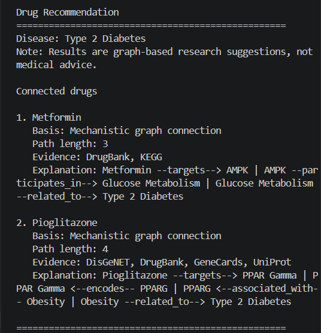
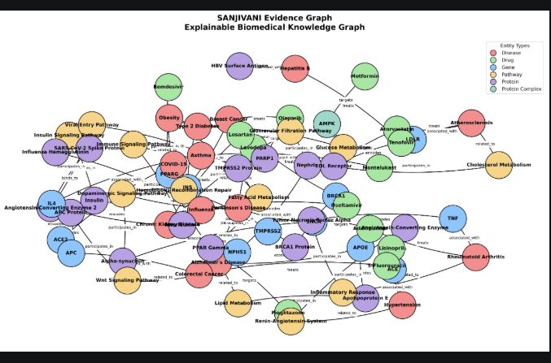

# 🧬 SANJIVANI

## Explainable Biomedical Intelligence Platform

> A research-oriented platform for exploring evidence-supported relationships among diseases, genes, proteins, pathways, and therapeutics through explainable biomedical knowledge graphs.

[](https://github.com/Ishitta-Sarkar/sanjivani-evidence-graph/releases)
[](https://www.python.org/)
[](https://streamlit.io/)
[](https://networkx.org/)
[](https://github.com/Ishitta-Sarkar/sanjivani-evidence-graph)

> **Note:** Replace the **Live App** link with your deployed Streamlit URL later.

---

# Overview

SANJIVANI is an explainable biomedical intelligence platform that enables interactive exploration of biomedical relationships using knowledge graphs.

The platform organizes diseases, genes, proteins, biological pathways, and therapeutics into an evidence-aware network that allows users to explore biological connections through transparent graph-based reasoning.

Rather than functioning as a black-box prediction system, SANJIVANI emphasizes explainability, allowing users to inspect biological paths, supporting evidence, and graph structure throughout the exploration process.

---

# Why SANJIVANI?

Biomedical information is distributed across numerous databases, publications, and pathway resources.

SANJIVANI brings these relationships together into a single interactive platform that supports:

- Bioinformatics education
- Computational biology research
- Drug-repurposing hypothesis exploration
- Biomedical network analysis
- Explainable graph exploration

---

# ✨ Features

- 🔎 Biomedical Entity Search
- 💊 Drug Recommendation Exploration
- 🧭 Multi-Hop Path Discovery
- 🧠 Explainable Biological Path Interpretation
- 📊 Path Confidence Scoring
- 🧾 Evidence Tracking
- 🎛 Evidence Source Filtering
- 🕸 Interactive Knowledge Graph
- 📌 Entity Quick Facts
- 📈 Graph Analytics Dashboard
- 📥 TXT Report Export
- 📄 CSV Evidence Export

---

# 📸 Demo

## Drug Recommendation Engine


---

## Graph Analytics



---

## Knowledge Graph Visualization



---

# 🏗 Architecture

```text
                 Streamlit Interface
                        │
                        ▼
              Biomedical Knowledge Graph
                        │
        ┌───────────────┼───────────────┐
        │               │               │
   Entity Search   Path Explorer   Graph Analytics
        │               │               │
        └───────────────┼───────────────┘
                        ▼
          Evidence-aware Biomedical Dataset
```
---

# ⚙ Installation

## 1. Clone the Repository

```bash
git clone https://github.com/Ishitta-Sarkar/sanjivani-evidence-graph.git
```

## 2. Move into the Project Directory

```bash
cd sanjivani-evidence-graph
```

## 3. Create a Virtual Environment

### Windows

```bash
python -m venv .venv
.venv\Scripts\activate
```

### macOS / Linux

```bash
python3 -m venv .venv
source .venv/bin/activate
```

## 4. Install Dependencies

```bash
pip install -r requirements.txt
```

## 5. Launch the Application

```bash
streamlit run app.py
```

The application will open automatically in your default web browser.

---

# 📁 Project Structure

```text
sanjivani-evidence-graph/
│
├── app.py
├── README.md
├── requirements.txt
│
├── data/
│   ├── entities.csv
│   └── relationships.csv
│
├── src/
│   ├── graph_builder.py
│   ├── entity_loader.py
│   └── data_validator.py
│
├── screenshots/
│   ├── drug_recommendation.png
│   ├── graph_analytics.png
│   └── graph_visualization.png
│
└── outputs/
```

---

# 🛠 Technology Stack

| Technology | Purpose |
|------------|---------|
| Python | Core programming language |
| Streamlit | Interactive web application |
| NetworkX | Knowledge graph construction & analytics |
| Pandas | Data processing |
| PyVis | Interactive graph visualization |
| CSV | Biomedical dataset storage |

---

# 🧪 Current Scope

Version **v1.0.0** currently supports:

- Biomedical knowledge graph exploration
- Explainable path discovery
- Drug recommendation exploration
- Confidence scoring
- Evidence filtering
- Interactive graph visualization
- Graph analytics
- TXT report generation
- CSV evidence export

The current release should be considered a research prototype intended for education and computational biology research.

---

# ⚠ Current Limitations

Current version limitations include:

- Demonstration-scale biomedical dataset
- Heuristic confidence scoring
- No machine learning model
- No automated literature retrieval
- No clinical validation

These limitations are intentionally documented to encourage transparent interpretation of results.
---

# 🗺 Roadmap

Future development of SANJIVANI may include:

- 🧬 Multi-omics data integration
- 🤖 Graph Neural Networks (GNNs)
- 📚 Automated biomedical literature mining
- 🔬 Molecular docking workflows
- 🧪 Drug-target prediction
- ☁️ Cloud deployment
- 🔗 REST API support
- 📈 Larger biomedical knowledge bases
- 👥 Research collaboration features

The roadmap reflects the long-term vision of SANJIVANI as a modular platform for computational biology and bioinformatics research.

---

# 👩‍💻 Author

## Ishitta Sarkar

**Academic Background**

- B.Tech Biotechnology
- Honours in 3D Printing in Biotechnology
- M.Tech Bioinformatics Student

**Research Interests**

- Bioinformatics
- Computational Biology
- Biomedical Knowledge Graphs
- Drug Discovery
- Systems Biology
- Biomedical Data Science
- Explainable AI

GitHub:

**https://github.com/Ishitta-Sarkar**

---

# 📖 Citation

If you reference this repository in academic or research work, please cite:

```text
Sarkar, I. (2026).

SANJIVANI: Explainable Biomedical Intelligence Platform.

Version 1.0.0.

GitHub Repository.
```

---

# © Copyright

```text
Copyright © 2026 Ishitta Sarkar

All Rights Reserved.
```

This repository is shared for portfolio, educational, and research demonstration purposes.

No separate open-source license is currently granted.

Please do not reproduce, redistribute, or present this work as your own without prior written permission from the author.

---

<p align="center">

## 🧬 SANJIVANI

Explainable Biomedical Intelligence Platform

Developed by Ishitta Sarkar

</p>